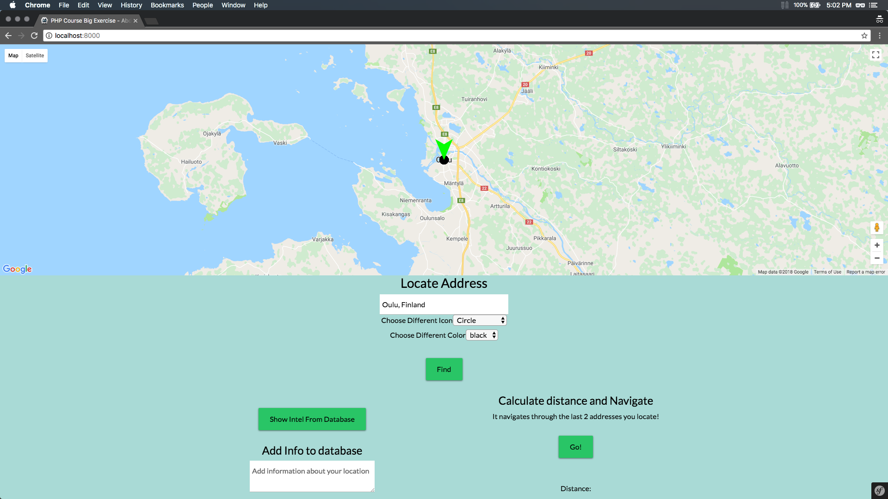

### PHP project for google map with Symfony

- Find Address 
- Add info to database (Fireabase)
- Fetch info from database 
- Calculating Distance, Navigate and Driving instruction 

### Screenshot

### How to

`composer install`

`php -S 127.0.0.1:8000 -t public`
